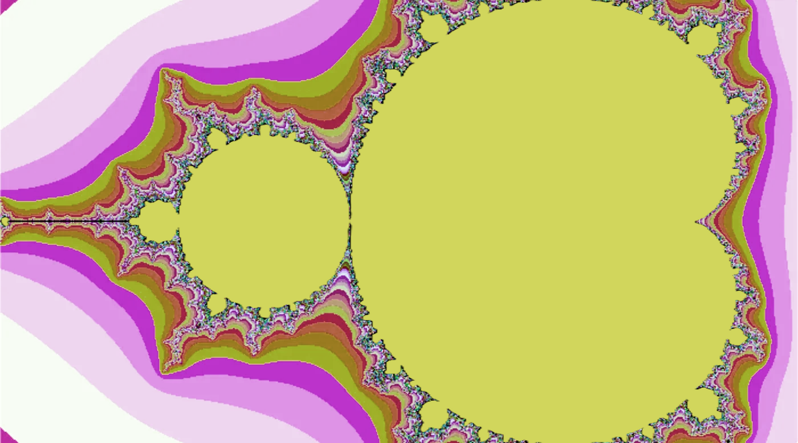

# fract-ol

An interactive fractal renderer built in C as part of the 42 school curriculum. It uses the MiniLibX graphics library to display and explore the **Mandelbrot** and **Julia** sets in real time.

---

## What I Learned / Skills Acquired

- **Complex number mathematics** — understanding how iterative formulas generate fractal geometry
- **Graphics programming with MiniLibX** — rendering pixels directly to a window using X11
- **Event handling** — keyboard and mouse hooks for interactive zoom, pan, and color changes
- **Memory management in C** — managing image buffers and window resources without leaks
- **Makefile structuring** — organizing a multi-file C project with library dependencies (`libft`, MiniLibX)
- **Color theory** — implementing multiple color-mapping schemes (classic, warm, cold, pastel, purple, cyan)
- **Floating-point precision** — mapping screen coordinates to the complex plane with zoom and offset

---

## Build & Run

### Prerequisites

- Linux with X11 (or compatible environment)
- `cc` (C compiler)
- MiniLibX Linux library (included as `minilibx-linux` inside the project directory)
- `libft` (included as `libft` inside the project directory)

### Build

```bash
cd fract-ol
make
```

This produces the `fractol` binary.

### Clean up

```bash
make clean    # remove object files
make fclean   # remove object files and the binary
make re       # full rebuild
```

### Run

```bash
# Mandelbrot set
./fractol mandelbrot

# Julia set (requires two floating-point parameters: real and imaginary parts of the constant)
./fractol julia -0.4 0.6
./fractol julia 0.285 0.01
```

If no valid argument is given, the program prints usage information and exits.

---

## Usage & Controls

| Action | Control |
|---|---|
| Zoom in | Scroll wheel up |
| Zoom out | Scroll wheel down |
| Pan | Arrow keys |
| Cycle color scheme | `+` key |
| Adjust Julia real part | `o` (decrease) / `p` (increase) |
| Close window | `ESC` or click the close button |

---

## Project Structure

```
fract-ol/
├── main.c              # Entry point; argument parsing and fractal initialisation
├── mandelbrot.c        # Mandelbrot set rendering
├── julia.c             # Julia set rendering
├── minilibx-utils.c    # Window, hooks, and pixel drawing utilities
├── color-utils.c       # Core color calculation
├── color-schemes.c     # Color palette definitions (classic, warm, cold …)
├── color-schemes2.c    # Additional palette definitions (pastel, purple, cyan)
├── init_fractal.c      # Fractal state initialisation helpers
├── fractol.h           # Shared header (structs, defines, prototypes)
├── Makefile
├── libft/              # Custom C utility library
└── minilibx-linux/     # MiniLibX graphics library
```

---

## Author

**ruortiz-** — 42 student
